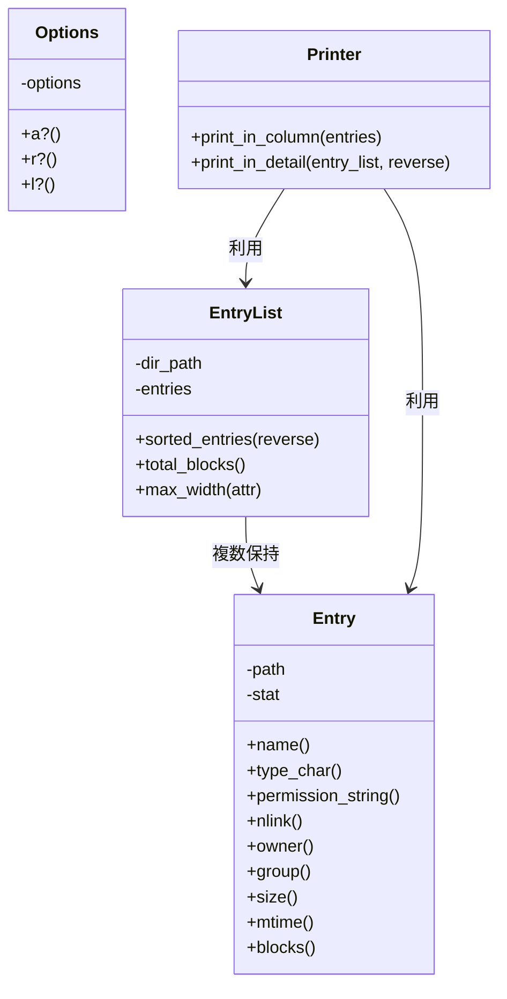

```mermaid
classDiagram
  class Entry {
    +name()
    +type_char()
    +permission_string()
    +nlink()
    +owner()
    +group()
    +size()
    +mtime()
    +blocks()
    -path
    -stat
  }

  class EntryList {
    +sorted_entries(reverse)
    +total_blocks()
    +max_width(attr)
    -dir_path
    -entries
  }

  class Options {
    +a?()
    +r?()
    +l?()
    -options
  }

  class Printer {
    +print_in_column(entries)
    +print_in_detail(entry_list, reverse)
  }

  EntryList --> Entry : 複数保持
  Printer --> Entry : 利用
  Printer --> EntryList : 利用
```
